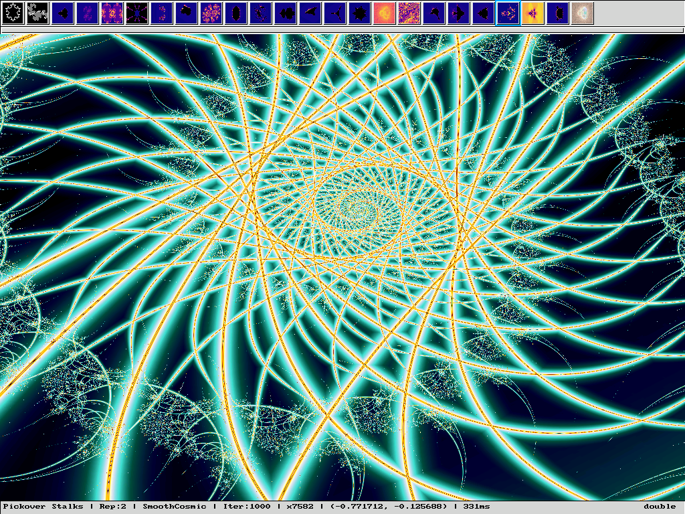

# fractall

A portable fractal explorer written in C using SDL.




## Features

- **24 fractal types**: Von Koch, Dragon, Mandelbrot, Julia, Newton, Phoenix, Burning Ship, Tricorn, Mandelbulb, Buddhabrot, Lyapunov, Nebulabrot, and more
- **9 smooth color palettes**: SmoothFire, SmoothOcean, SmoothForest, SmoothViolet, SmoothRainbow, SmoothSunset, SmoothPlasma, SmoothIce, SmoothCosmic
- **Smooth coloring**: Eliminates visible color bands using continuous iteration interpolation
- **Interactive zoom**: Click to zoom in/out, rectangular selection zoom for escape-time fractals
- **Status bar**: Displays fractal type, palette, iterations, zoom level, coordinates, and render time
- **PNG export**: Save screenshots with embedded fractal metadata
- **Optional GMP support**: High-precision arithmetic for deep zooms
- **Performance optimizations**: OpenMP multi-threading, SIMD (SSE4.1/AVX)


## Building

```bash
./autogen.sh      # If configure doesn't exist
./configure
make
./src/fractall
```

### Configure Options

| Option | Description | Default |
|--------|-------------|---------|
| `--with-gmp` | Enable high-precision arithmetic | enabled |
| `--disable-openmp` | Disable parallel computation | enabled |
| `--disable-simd` | Disable SIMD (SSE4.1/AVX) | enabled |
| `--with-png` | Enable PNG export with metadata | enabled |

### Dependencies

- SDL 1.2.0+
- Standard math library (`-lm`)
- GMP (optional): High-precision arithmetic for deep zooms
- OpenMP (optional): Multi-threaded rendering
- libpng (optional): PNG export with metadata

## Usage

```bash
fractall [OPTIONS]
```

| Option | Description | Default |
|--------|-------------|---------|
| `-x<n>` | Window width | 800 |
| `-y<n>` | Window height | 600 |
| `-f` | Fullscreen mode | - |
| `-g<n>` | GUI height | 51 |
| `-nogui` | Disable GUI | - |
| `-h` | Show help | - |

## Controls

| Key/Action | Effect |
|------------|--------|
| **F1-F12** | Select fractal types 1-12 |
| **GUI buttons** | Select any of the 24 fractal types |
| **C** | Cycle color palette (9 palettes) |
| **R** | Cycle gradient repetition (2-40, step 2) |
| **S** | Screenshot (PNG with metadata) |
| **Q** / **ESC** | Quit |
| **Left click** | Zoom in / +1 iteration (vector fractals) |
| **Left click + drag** | Rectangular selection zoom (escape-time) |
| **Right click** | Zoom out / -1 iteration (vector fractals) |

## Fractal Types

### Vector Fractals (Types 1-2)
- **Von Koch** - Snowflake fractal (max 8 iterations)
- **Dragon** - Dragon curve (max 20 iterations)

### Escape-Time Fractals (Types 3-24)
- **Mandelbrot** - The classic z = z² + c
- **Julia** - Julia set with configurable seed
- **Julia Sin** - z = c × sin(z)
- **Newton** - Newton's method fractal
- **Phoenix** - Phoenix fractal
- **Buffalo** - |Re(z²)| + i|Im(z²)| + c
- **Barnsley J/M** - Barnsley fractal variants
- **Magnet J/M** - Magnetic fractal variants
- **Burning Ship** - Uses absolute values
- **Tricorn** - Uses complex conjugate
- **Mandelbulb** - 2D slice of 3D fractal (power 8)
- **Buddhabrot** - Density-based rendering of escape trajectories
- **Lyapunov Zircon City** - Lyapunov exponent (sequence "BBBBBBAAAAAA")
- **Perpendicular Burning Ship**, **Celtic**, **Alpha Mandelbrot**
- **Pickover Stalks**, **Nova**, **Multibrot**, **Nebulabrot**

## Color Palettes

| # | Palette | Gradient |
|---|---------|----------|
| 0 | SmoothFire | Black → Red → Yellow → White |
| 1 | SmoothOcean | Black → Blue → Cyan → White |
| 2 | SmoothForest | Black → Green → Yellow → White |
| 3 | SmoothViolet | Black → Violet → Pink → White |
| 4 | SmoothRainbow | Full rainbow spectrum |
| 5 | SmoothSunset | Black → Orange → Red → Violet → Blue |
| 6 | SmoothPlasma | Blue → Violet → Pink → Orange (default) |
| 7 | SmoothIce | White → Cyan → Blue → Black |
| 8 | SmoothCosmic | Black → Blue → Turquoise → Yellow → Orange → Red |

All palettes use continuous iteration interpolation to eliminate visible color banding. Gradient repetition adjustable with **R** key (default: 40).

## Screenshots

Press **S** to save the current fractal as PNG with embedded metadata (type, coordinates, iterations, palette, etc.).

## Changelog

- **1.0** (2026) - Major rewrite: 24 fractal types, 9 palettes, PNG export, OpenMP/SIMD optimizations, optimized Lyapunov calculation
- **0.5.1** (2025) - Added smooth coloring, status bar, bug fixes
- **0.5** (2003) - Initial release

## Author

Arnaud VERHILLE (2001-2026)
